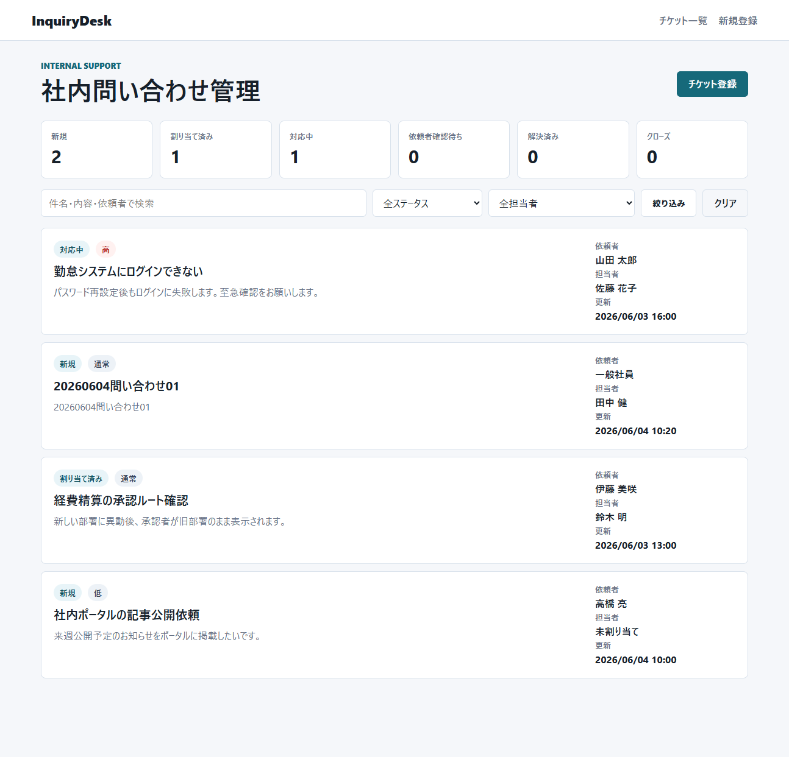

# InquiryDesk

C# / ASP.NET Core を使用した「社内問い合わせ管理システム」のポートフォリオ実装です。
社内ヘルプデスクや情報システム部門で扱う問い合わせを想定し、チケット登録、担当者割り当て、ステータス管理を行える業務系Webアプリとして作成しました。



## 機能

- 問い合わせチケットの登録、一覧、詳細、編集、削除
- 担当者の割り当て
- ステータス管理
- 優先度、キーワード、担当者による絞り込み
- ステータス別件数のダッシュボード表示
- DataAnnotations による入力検証
- DI とサービス層を使った責務分離

## 技術構成

- ASP.NET Core MVC
- Razor Views
- C# 12 / .NET 8
- インメモリリポジトリ
- HTML / CSS

## 構成

```text
Controllers/  リクエスト受付と画面遷移
Models/       チケット、担当者、検索条件などのモデル
Services/     問い合わせデータ操作の抽象化と実装
Views/        Razorによる画面表示
wwwroot/      CSSなどの静的ファイル
screenshot/  README掲載用スクリーンショット
```

## 実装ポイント

ASP.NET Core MVC の基本構成に沿って、Controller、Model、View、Service を分離しています。
リポジトリはインメモリ実装ですが、`IInquiryRepository` を介して利用しているため、後から Entity Framework Core や SQL Server へ差し替えやすい構成です。

## 実行方法

.NET 8 SDK が入っている環境で以下を実行してください。

```powershell
dotnet restore
dotnet run
```

起動後、表示された `http://localhost:xxxx` または `https://localhost:xxxx` にアクセスします。

この環境では `http://localhost:5052` または `https://localhost:7052` で起動確認しました。

## Windowsログオン時の自動起動

開発用PCで毎回 `dotnet run` する手間を減らしたい場合は、タスク スケジューラにログオン時起動を登録できます。

```powershell
powershell -ExecutionPolicy Bypass -File .\scripts\register-startup-task.ps1
```

登録後、次回ログオン時に `http://localhost:5052` で InquiryDesk が自動起動します。
起動ログは `logs/` に出力されます。

登録時に権限エラーが出る場合は、通常の PowerShell または VS Code ターミナルから同じコマンドを実行してください。

解除する場合は以下を実行します。

```powershell
powershell -ExecutionPolicy Bypass -File .\scripts\unregister-startup-task.ps1
```
